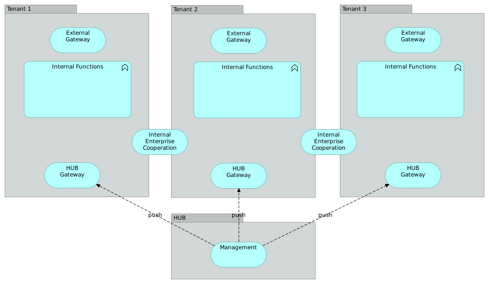
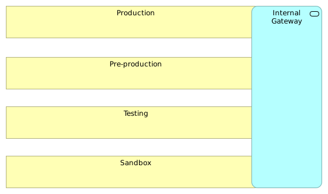
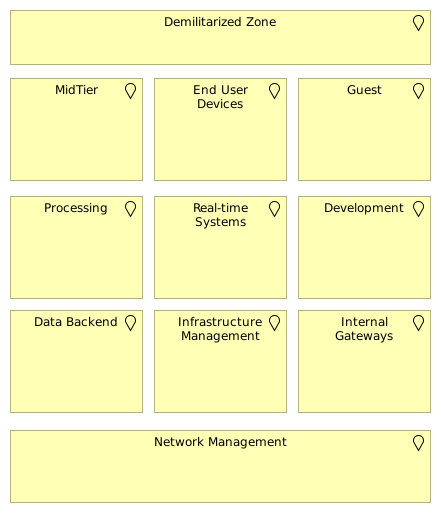
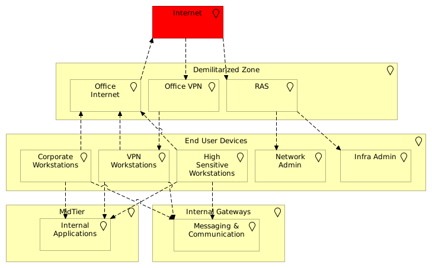

###############
Enterprise view
###############

The *Enterprise Architecture* in this book focuses on the services displayed in
the following diagram:

.. image:: enterprise_architecture.png
   :width: 100 %

In it, IT services that are provided are shown and as such can be used by the
enterprise at large. Of course, a decent enterprise architecture goes beyond
the IT services. In fact, IT services are just a small part of an enterprise
architecture. However, as this resource focuses on an advanced usage of Gentoo
Linux in a larger context, focus will be on the IT services which can then be used
by other business functions in the organization.

The larger an environment is, the more complex it might seem to position
services left or right. A new workstation needs to be put inside a network
segment (which one?), possibly assigned to a central LDAP server and structure
(which tree in the LDAP?). Servers could be for one customer or another. Having
a high-level structure for positioning services provides a quick way of
dealing with more general requirements: allowed data flows, location of the
central user repository, security measurements and more.

Structuring the Environment
===========================

To support flexibility in a large organization, structure in the deployments
and the service positioning needs to be provided. Large organizations often
have multiple business units, each with their own requirements and risk
appetite. If IT services in such an organization are standardized towards
a single offering, then it is very likely that the majority of business units
are not satisfied with the IT offering.

Below is an example structure, where focus is first on the multi-tenancy of
the IT service architecture. Within each tenant, SLA groups are provided
(which contain the production and non-production environments) and then the
architectural blueprint for each SLA group.

Finally, the categories within each architectural block are considered.

Multi-tenancy
-------------

In a multi-tenant organization, several larger customers (in case of an IT service
company) or business units are identified. Each of these "tenants" probably have
very different requirements and might take risks in their architecture that other
tenants won't. For this reason alone, the example architecture introduces 
differentiation between tenants immediately at the highest level.

In the example tenant architecture, a hub is anchored which provides management
services towards various tenants. These management services are generally the 
IT services that are provided towards all tenants.

In the architecture, the choice was made to not use a central management service
directly, but push the necessary management services towards a hub gateway. This
is a deliberate choice in the above architecture, as one of the principles that
the example architecture wants to implement is loose coupling on tenant level.

This has consequences of course, and the choice is one that every company needs
to make for itself. One of the consequences is that service reusability is
implemented on the processes but not on the implementation, which has a higher
cost aspect. In the example case, the principle is done to allow fast mergers
and acquisitions (additional tenants) and spin-offs (removal of a tenant and
making a tenant self-sustaining).

Communication between tenants can be done on two levels:

* Through *External Gateways* which act as business-to-business (B2B) services.
  In this case, the communication is decoupled from internal structures and the
  target tenants (or even other companies) are generally not trusted. In other
  words, these gateways are hardened and they do not assume anything about the
  target business
* The *Internal Enterprise Cooperation* (IEC), which is usually where an Enterprise
  Service Bus (ESB) is positioned, has a higher trust level towards other
  tenants. Assumptions *can* be made about the other tenant. Communication
  through the IEC is generally done through a *trust but verify* relationship.

SLA Groups
----------

Larger environments will have different SLA groups. Those could be called
"production", "preproduction", "testing" and "sandbox" for instance. Smaller
organizations might have just two, or even one SLA group.

The segregation between the SLA groups is mainly meant to make proper service level
agreements possible on the various services. Additional advantages can be found
based on the role that looks at them though. For instance, from a security and
risk mitigation point of view, high level communication flows can be made more
clear.

For instance, communication of data between production and pre-production might
be possible, but has to be governed through the proper gateways or control
points.

Architectural positioning
-------------------------

The next differentiator is the architectural positioning. This gives a
high-level overview of the various IT services provided by an organization, 
and allows for new systems to be positioned within a *zone* from which the 
system will automatically inherit a lot of non-functional requirements,
security measures, data flow controls, data management and more.

Again, this picture has additional advantages for the various IT roles within
an organization as it clarifies where which system is positioned. For instance,
from a security point of view, one might have additional requirements on the 
MidTier zone (strong focus on protection against injection attacks, no data 
storage, files must be scanned before send further, etc.)

Categories
----------

Finally, categories are the last "drill-down" into an architecture. It is the
level on which things such as course-grained firewall rules are defined, where
data flows are governed, where policies and principles are applied on.

Consider the following snippet based on some end user device categories:

The categories defined are:

* *Corporate workstations* for the regular employees. These workstations are
  probably well managed, perhaps employees do not even hold administrative
  rights on the systems.
* *High sensitive workstations* are for executive committee and board members,
  who have access to sensitive information, yet require a more "personal"
  management approach.
* *VPN workstations* are similar to corporate workstations, but these are not
  hosted inside the company but on remote locations and access the infrastructure
  through the VPN.
* *Network admin* and *Infra admin* are workstations who will need access to 
  management systems that regular employees do not need access to, but might
  also require the users to have administrative rights on the workstations

These are just examples of course, but show that there is no such thing as a 
"single" end user device service. Companies might have specific zone categories
for mobile devices (although a true Bring Your Own Device (BYOD) is probably better
positioned as part of a guest zone rather than in the End user device zone).

Categories are often made based on the context of the users (or other systems)
accessing a system. For instance, for mid tier application servers, categories
can exist for Internet disclosed applications, internal applications,
authenticated customer applications, business-to-business (B2B) applications,
etc. Segregation between those categories helps reduce the risk involved with
a potential breach.

Services versus zones
=====================

In the first drawing, a high-level service overview was provided. That diagram
does not resonate with the structure mentioned later in this chapter. This is
not an accident: the structure is meant for focusing on the *non-functional* 
requirements of IT infrastructure.

Such requirements are also known as the *-ities*, properties of a system that
are not part of the functional requirements that the end users, sponsors or
stakeholders have put in (behavior to support user goals, tasks or activities),
but focus on things such as availability, recoverability, usability, scalability,
maintainability, etc.

.. important:: Although this text focuses on IT services, it should fit in a larger
   approach to structure and model all services within the company. This includes
   all business services. IT services are just one part of this bigger picture,
   meant to support that business and help put innovation and flexibility within
   the business.

Subpages
========

.. toctree::
   :maxdepth: 2

   basic_infrastructure/index.rst
   management_control_services/index.rst
   supporting_infrastructure/index.rst

